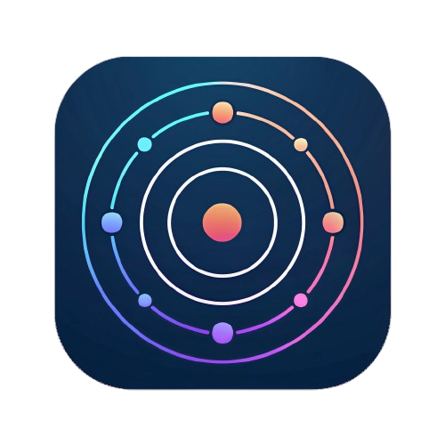

# Orbit - Firefox Tab Group Manager

<div align="center">



**Advanced tab group management for Firefox with container support and proxy integration**

[](https://github.com/KhanhRomVN/Orbit)
[](https://www.mozilla.org/firefox/)
[](LICENSE)

[Features](#features) • [Installation](#installation) • [Quick Start](#quick-start) • [Documentation](#documentation)

</div>

---

## Overview

Orbit transforms Firefox tab management with intelligent grouping, container integration, and proxy support. Organize tabs by projects, manage multiple Claude.ai sessions, and control network routing - all from a seamless sidebar interface.

### Why Orbit?

- **Container Integration**: Leverage Firefox containers for isolated browsing sessions
- **Smart Tab Groups**: Organize tabs by project, context, or workflow
- **Proxy Management**: Per-container or per-tab proxy configuration
- **Claude.ai Focus**: Special support for managing multiple Claude conversations
- **WebSocket Bridge**: Connect with VS Code extensions for AI-powered workflows
- **Beautiful UI**: Modern, themeable interface with dark mode support

---

## Features

### Tab Group Management

- **Custom Groups**: Create unlimited tab groups with custom names and colors
- **Container Groups**: Automatically group tabs by Firefox container
- **Drag & Drop**: Intuitive tab organization (planned)
- **Bulk Operations**: Sleep, close, or move multiple tabs at once
- **Persistent State**: Groups survive browser restarts

### Container Support

- **Native Integration**: Full support for Firefox Multi-Account Containers
- **Auto-Assignment**: New tabs automatically join their container's group
- **Visual Indicators**: Clear badges show container and proxy status
- **Isolated Sessions**: Separate cookies, cache, and browsing data per container

### Proxy Configuration

- **HTTP/HTTPS/SOCKS5**: Support for all major proxy types
- **Per-Container Proxy**: Apply proxy to all tabs in a container
- **Per-Tab Proxy**: Override container proxy for specific tabs
- **Authentication**: Username/password support for proxy servers
- **Expiry Tracking**: Monitor proxy subscription expiration dates

### Claude.ai Integration

- **Focused Tab Management**: Designate one Claude tab per container as "focused"
- **WebSocket Bridge**: Connect to VS Code for seamless AI workflows
- **Multi-Session Support**: Maintain separate conversations across containers
- **Real-time Sync**: Bidirectional communication with development tools

### UI/UX

- **Sidebar Interface**: Always-accessible tab management
- **Theme System**: Multiple preset themes (light and dark)
- **Zoom Control**: Adjust UI scale with Ctrl+Wheel
- **Keyboard Shortcuts**: Quick access to common operations
- **Responsive Design**: Clean, modern Tailwind CSS styling

---

## Installation

### From Source

1. **Clone Repository**
   ```bash
   git clone https://github.com/KhanhRomVN/Orbit.git
   cd Orbit
   ```

2. **Install Dependencies**
   ```bash
   npm install
   ```

3. **Build Extension**
   ```bash
   npm run build
   ```

4. **Load in Firefox**
   - Open `about:debugging#/runtime/this-firefox`
   - Click "Load Temporary Add-on"
   - Select `dist/manifest.json`

### Development Mode

```bash
npm run dev
# Extension auto-reloads on code changes
```

---

## Quick Start

### 1. Create Your First Group

1. Click the Orbit icon in Firefox toolbar
2. Open the sidebar
3. Click the "+" button in the header
4. Choose "Custom" or "Container" group type
5. For container groups, select a Firefox container
6. Your group is ready!

### 2. Managing Tabs

**Add Tabs to Group:**
- New tabs automatically join the active group
- Click group name to make it active
- Use "Add New Tab" button in group menu

**Switch Between Groups:**
- Click any group name to activate it
- Active group's tabs become visible
- Other groups' tabs are hidden

**Tab Actions:**
- Right-click tab for context menu
- Sleep individual tabs to save memory
- Close tabs with X button
- More options via three-dot menu

### 3. Container Groups

**Create Container Group:**
1. Click "+" → "Container"
2. Select a Firefox container
3. Group name auto-fills from container
4. All tabs in that container join this group

**Benefits:**
- Automatic tab organization
- Isolated browsing sessions
- Per-container proxy support
- Clear visual indicators

### 4. Proxy Configuration

**Add Proxy:**
1. Click three-dot menu on container group
2. Select "Proxy"
3. Choose existing proxy or add new
4. Configure: Type, Address, Port, Credentials
5. Proxy applies to all tabs in container

**Proxy Types:**
- HTTP: Standard web proxy
- HTTPS: Encrypted proxy connection
- SOCKS5: Full protocol proxy support

### 5. Claude.ai Focus (Advanced)

**Setup:**
1. Create container groups for different projects
2. Open Claude.ai in each container
3. Right-click Claude tab → "Chatbot Focus"
4. Only one tab per container can be focused

**WebSocket Integration:**
1. Start WebSocket server in VS Code (OrbitAI extension)
2. Orbit automatically connects on startup
3. Send prompts from VS Code to focused Claude tabs
4. Responses flow back through WebSocket

---

## Documentation

### Group Types

#### Custom Groups
- User-defined tab collections
- No container restriction
- Flexible organization
- Manual tab management

#### Container Groups
- Linked to Firefox container
- Automatic tab assignment
- Isolated browsing context
- Proxy support enabled

### Tab States

- **Active**: Currently focused tab
- **Visible**: Part of active group
- **Hidden**: In inactive group
- **Sleeping**: Discarded to save memory

### Proxy Management

**Adding Proxies:**
```
Format: address:port:username:password
Example: proxy.example.com:8080:user:pass
```

**Assignment Levels:**
1. Container-wide (all tabs in container)
2. Tab-specific (overrides container proxy)

**Status Indicators:**
- **P Badge**: Proxy active on container
- **C Badge**: Container tab (custom groups only)
- **F Badge**: Focused Claude tab

### WebSocket Protocol

**Connection:**
- URL: `ws://localhost:3031`
- Auto-reconnect on disconnect
- Bi-directional message flow

**Message Types:**

**From Browser:**
```json
{
  "type": "focusedTabsUpdate",
  "data": [
    {
      "tabId": 123,
      "title": "Claude",
      "containerName": "Project A",
      "url": "https://claude.ai/chat/..."
    }
  ]
}
```

**From VS Code:**
```json
{
  "type": "sendPrompt",
  "requestId": "uuid",
  "tabId": 123,
  "prompt": "Explain this code..."
}
```

### Keyboard Shortcuts

- **Ctrl+Wheel**: Zoom sidebar UI in/out
- **Click Group**: Switch to group
- **Click Tab**: Focus tab (activates group if needed)

### Theme Customization

**Built-in Themes:**
- Light: Default, Sky, Sunset, Forest, Ocean
- Dark: Default, Midnight, Purple, Emerald, Rose

**Custom Themes:**
Themes use CSS custom properties. Edit in sidebar header → palette icon.

---

## Architecture

### Core Components

```
Orbit Extension
├── Background Scripts (Manifest V2)
│   ├── Service Worker (service-worker.ts)
│   ├── Tab Manager (tab-manager.ts)
│   ├── Focused Tabs Manager (focused-tabs-manager.ts)
│   ├── Proxy Manager (proxy-manager.ts)
│   ├── WebSocket Client (websocket-client.ts)
│   └── Message Handler (message-handler.ts)
├── Content Scripts
│   └── Claude Content (claude-content.ts)
├── Sidebar UI (React + TypeScript)
│   ├── Sidebar Component
│   ├── Group Card Component
│   ├── Tab Item Component
│   └── Theme Provider
└── Storage
    ├── Local Storage (groups, proxies, focus)
    └── Session Storage (runtime state)
```

### Technology Stack

- **Language**: TypeScript
- **UI Framework**: React 18
- **Styling**: Tailwind CSS
- **Build Tool**: Vite
- **Icons**: Lucide React
- **Storage**: Firefox Storage API
- **Networking**: WebSocket, WebRequest API

### Data Flow

1. **Tab Events** → Tab Manager → Storage → UI Update
2. **User Action** → UI → Message Handler → Background Script
3. **Proxy Request** → Proxy Manager → WebRequest Handler
4. **Focus Change** → Focused Tabs Manager → WebSocket → VS Code

---

## Configuration

### Manifest Permissions

```json
{
  "permissions": [
    "tabs", "activeTab", "storage", "cookies",
    "contextualIdentities", "tabHide", "proxy",
    "webRequest", "webRequestBlocking"
  ]
}
```

### Storage Schema

**Tab Groups:**
```typescript
{
  tabGroups: [
    {
      id: string,
      name: string,
      type: "custom" | "container",
      color: string,
      icon: string,
      tabs: ExtendedTab[],
      containerId?: string,
      lastActiveTabId?: number,
      createdAt: number
    }
  ]
}
```

**Proxy Configuration:**
```typescript
{
  "orbit-proxies": [
    {
      id: string,
      name: string,
      type: "http" | "https" | "socks5",
      address: string,
      port: number,
      username?: string,
      password?: string,
      purchaseDate?: string,
      duration?: number,
      expiryDate?: string,
      isActive: boolean
    }
  ]
}
```

---

## Troubleshooting

### Common Issues

**Tabs not showing in group:**
1. Check if group is active (click group name)
2. Verify tab's container matches group container
3. Refresh sidebar (close/reopen)
4. Check browser console for errors

**Proxy not working:**
1. Verify proxy credentials
2. Check proxy type (SOCKS5 uses "socks" in Firefox)
3. Ensure container has proxy assigned (P badge)
4. Test proxy in browser network settings
5. Check Firefox console for WebRequest errors

**WebSocket connection fails:**
1. Verify VS Code extension is running
2. Check port 3031 is not blocked
3. Look for firewall restrictions
4. Restart both extension and VS Code
5. Check OrbitAI extension output panel

**Container groups not working:**
1. Install Firefox Multi-Account Containers addon
2. Create containers in Firefox settings
3. Refresh Orbit extension
4. Try creating container group again

### Debug Mode

Enable detailed logging:
1. Open `about:debugging`
2. Find Orbit extension
3. Click "Inspect"
4. Check Console tab for detailed logs

### Reset Extension

```javascript
// Run in extension console
chrome.storage.local.clear()
chrome.runtime.reload()
```

---

## Development

### Project Structure

```
Orbit/
├── src/
│   ├── background/          # Service worker & managers
│   ├── content-scripts/     # Claude.ai integration
│   ├── presentation/        # React UI components
│   │   ├── components/
│   │   │   ├── common/      # Reusable UI components
│   │   │   ├── sidebar/     # Sidebar-specific components
│   │   │   └── proxy/       # Proxy management UI
│   │   └── providers/       # React context providers
│   ├── shared/              # Utilities and hooks
│   ├── styles/              # Global CSS
│   └── types/               # TypeScript definitions
├── public/
│   └── icons/               # Extension icons
├── manifest.json            # Firefox extension manifest
└── vite.config.ts           # Build configuration
```

### Build Commands

```bash
# Development with hot reload
npm run dev

# Production build
npm run build

# Type checking
npm run type-check

# Lint code
npm run lint

# Package for distribution
npm run package
```

### Contributing

We welcome contributions! Areas for improvement:

- Test coverage (unit & integration tests)
- Drag-and-drop tab reordering
- Import/export group configurations
- Tab search and filtering
- Group templates
- Performance optimizations
- Accessibility improvements

---

## Roadmap

### Version 1.1 (Planned)
- [ ] Drag-and-drop tab reordering
- [ ] Advanced search and filtering
- [ ] Group templates/presets
- [ ] Enhanced keyboard navigation
- [ ] Performance optimizations

### Version 1.2 (Future)
- [ ] Tab session management
- [ ] Cloud sync for groups
- [ ] Advanced automation rules
- [ ] Browser history integration
- [ ] Enhanced analytics

### Version 2.0 (Vision)
- [ ] Cross-browser support (Chrome, Edge)
- [ ] Collaborative features
- [ ] AI-powered tab suggestions
- [ ] Advanced workflow automation

---

## Technical Notes

### Firefox-Specific Features

**Tab Hiding API:**
```javascript
browser.tabs.hide([tabIds])
browser.tabs.show([tabIds])
```

**Container API:**
```javascript
browser.contextualIdentities.query({})
browser.contextualIdentities.get(cookieStoreId)
```

**Proxy API:**
```javascript
browser.proxy.onRequest.addListener(
  (requestInfo) => ({
    type: "socks",
    host: "proxy.example.com",
    port: 8080
  })
)
```

### Performance Considerations

- Tab state cached in memory
- Storage writes debounced
- UI updates batched with React
- WebSocket messages queued
- Lazy loading for large groups

---

## License

MIT License - see [LICENSE](LICENSE) file for details.

---

## Author

**KhanhRomVN**
- GitHub: [@KhanhRomVN](https://github.com/KhanhRomVN)
- Email: khanhromvn@gmail.com

---

## Acknowledgments

- Firefox WebExtensions team for excellent APIs
- React team for the UI framework
- Tailwind CSS for styling utilities
- Anthropic for Claude AI integration inspiration

---

## Support

- Issues: [GitHub Issues](https://github.com/KhanhRomVN/Orbit/issues)
- Discussions: [GitHub Discussions](https://github.com/KhanhRomVN/Orbit/discussions)
- Email: khanhromvn@gmail.com

---

<div align="center">

**Made with ❤️ for Firefox power users**

If you find Orbit useful, please consider starring the repository!

</div>